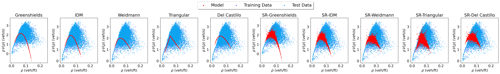

# SR-Traffic

<p align="center">

</p>

This repository contains the code used to produce the results of the paper [SR-Traffic: Discovering Macroscopic Traffic Flow Models with Symbolic Regression](https://ml4physicalsciences.github.io/2025/files/NeurIPS_ML4PS_2025_105.pdf)

## Installation

The dependencies are collected in `environment.yaml` and can be installed, after cloning the repository, using [`mamba`]("https://github.com/mamba-org/mamba"):

```bash
$ mamba env create -f environment.yaml
```

Once the environment is installed and activated, install the library using

```bash
$ pip install -e .
```

## Usage

To reproduce the results of the paper just run

```bash
$ python src/sr_traffic/fund_diagrams/fund_diagrams_results.py --road_name {road_name} --task {task_name}
```

where `{road_name}` is either `US101` or `US80`, and `{road_name}` is either `prediction` or `reconstruction`.

To re-calibrate a given fundamental diagram, run

```bash
$ python src/sr_traffic/fund_diagrams/fund_diagrams_calibration.py  --config src/sr_traffic/fund_diagrams/configs/{fnd_name}.yaml
```

where`{fnd_name}` is either `greenshields`, `triangular`, `Weidmann`, `del_castillo`, or `idm`.

Finally, to perform a run of SR-Traffic, run

```bash
$ python src/sr_traffic/learning/stgp_traffic.py
```

You can change the parameters of the algorithm modifying `stgp_traffic.yaml`.

## Citing

```
@article{mantisr,
  title={{SR}-{T}raffic: {D}iscovering {M}acroscopic {T}raffic {F}low {M}odels with {S}ymbolic {R}egression},
  author={Manti, S. and Mohammadian, S. and Treiber, M. and Lucantonio, A.},
  journal={Neural Information Processing Systems, ML4PS Workshop},
  year={2025}
}
```
